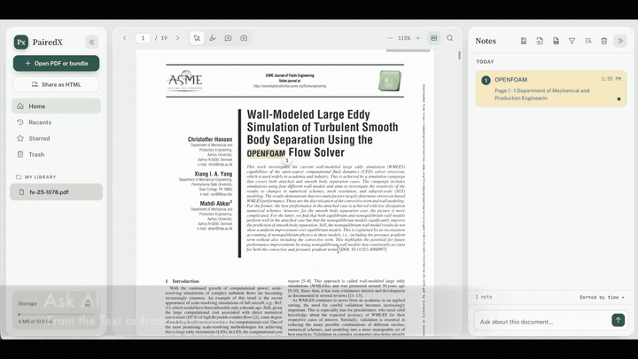
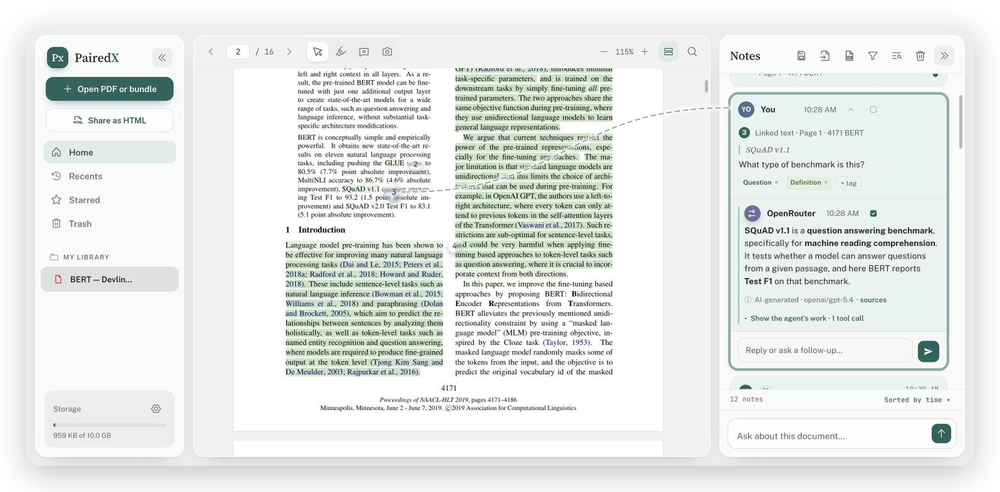
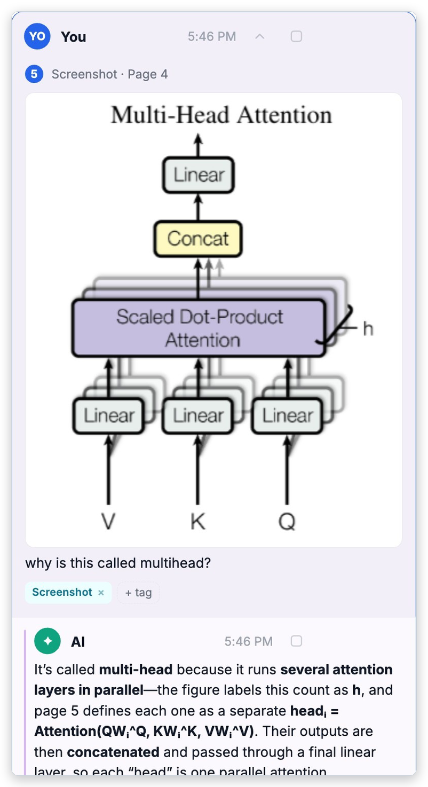
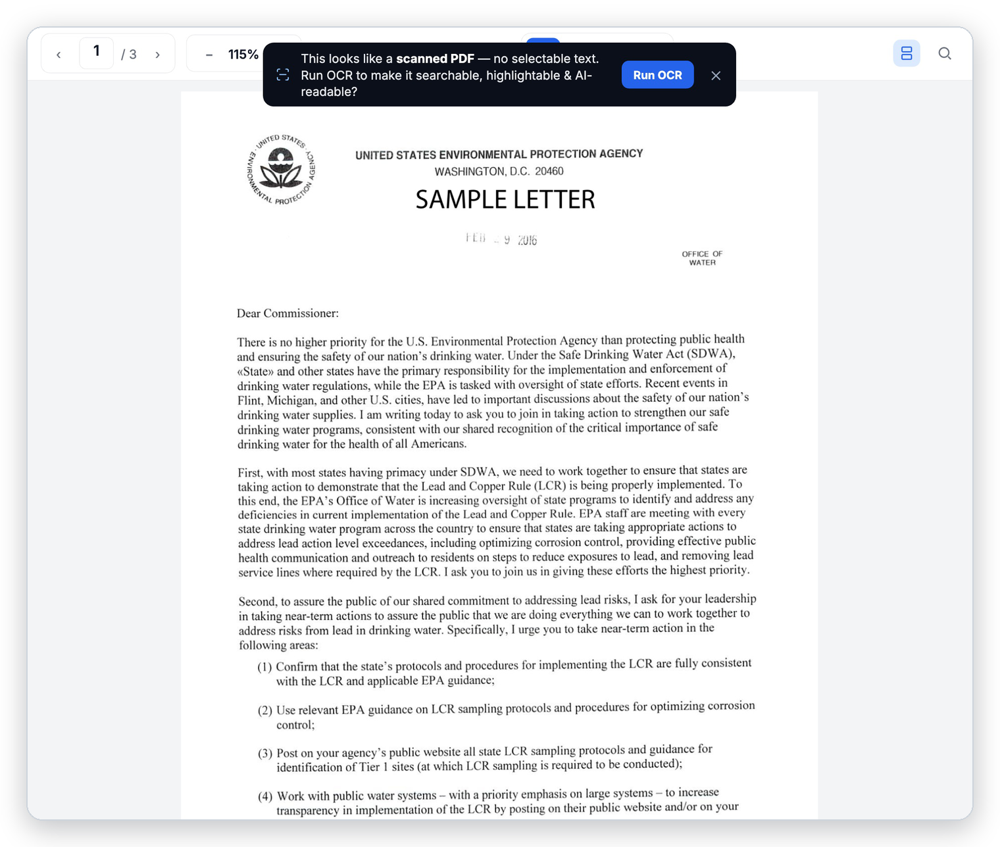
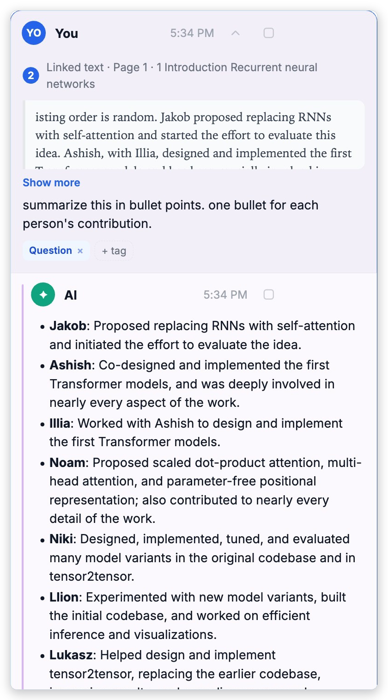
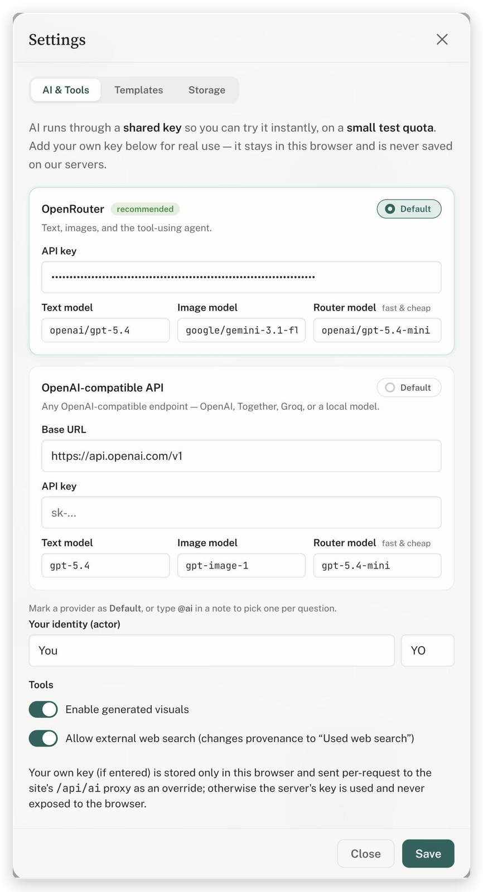
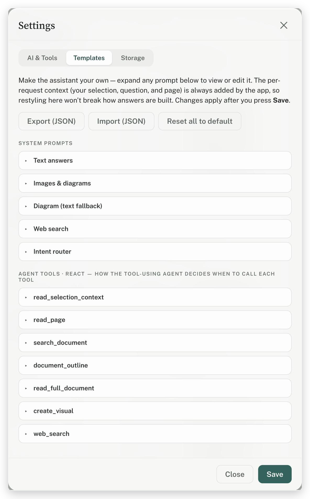

# PairedX — a source-linked AI reading workspace

> **Not another chat‑with‑your‑PDF.** An AI reading workspace that stays **pinned to the source**: every highlight, note, screenshot, and answer anchors to the exact spot it came from, so nothing floats free of its evidence. Your PDF never leaves your machine, you bring your own model, and your notes are a portable file you own — open‑source and self‑hostable (AGPL).

**▶ Try it now: [pairedx.com](https://pairedx.com)** — no signup, no install. Hit **Open app** to load the bundled *Attention Is All You Need* sample, or drop in your own PDF. · **[See every feature →](https://pairedx.com/features.html)**

<div align="center"><a href="https://pairedx.com/app"></a></div>

<div align="center"><sub>▶ <b><a href="https://pairedx.com">Watch the full walkthrough</a></b> — highlight → ask → source-pinned answer</sub></div>

<div align="center"><a href="#what-it-is">What it is</a> · <a href="#every-note-stays-linked-to-its-source">Source-linked notes</a> · <a href="#scanned-pdfs-read-like-real-text--on-your-device">Scanned-PDF OCR</a> · <a href="#why-its-different">Why it's different</a> · <a href="#using-the-app">Using the app</a> · <a href="#configure-the-ai">Configure the AI</a> · <a href="#deploy-your-own-vercel"><b>Deploy your own →</b></a> · <a href="#run-locally"><b>Run locally →</b></a> · <a href="#how-it-works-codebase">How it works</a> · <a href="#privacy--keys">Privacy &amp; keys</a> · <a href="#license">License</a></div>

---

## What it is

A single-user, in-browser reading workspace for papers and reports. Open a PDF, highlight text or screenshot a figure, and ask an AI about it — the answer is saved as a note **linked to that exact passage or region**, with a visible connector back to the page. Everything lives in your browser (and, optionally, in a portable `.notes.json` next to your PDF).

- **Source-linked notes** — highlights, comments, screenshots, and AI answers all pin to their location in the document.
- **A tool-using AI agent** — for questions it needs more context for, the AI can read other pages, search the whole document, pull the outline, and generate diagrams/images — you can watch every step under *“Show the agent’s work.”*
- **Renders math & code** — LaTeX (`\( … \)`, `\[ … \]`, `$$ … $$`) is typeset with MathJax; fenced code blocks render as code.
- **Screenshots of figures** — box any figure/equation and ask about it directly.
- **Share a whole annotated paper** — export the document + notes as one self-contained `.html` that opens anywhere (read-only) and re-opens in PairedX to keep editing.
- **Notes re-attach by content** — a PDF is identified by the SHA-256 of its bytes, so the same paper opened under a different name, folder, or machine picks its notes back up automatically.
- **Continuous or single-page** reading, with find-in-document, filters, and tags.
- **Scanned PDFs get OCR'd on-device** — an image-only PDF is auto-detected; one tap runs OCR **entirely in your browser** (nothing uploaded) and rebuilds a real text layer, so find, highlights, and the AI work like a normal text PDF. Results cache, so it runs once.
- **Bring your own model** — OpenRouter (default) or any OpenAI-compatible endpoint. Your key is stored only in your browser.
- **Portable storage** — notes stay in the browser and can auto-save to a folder as `<doc>.notes.json` (Chrome/Edge), so they travel with the PDF (great for Drive folders and other machines). Export/Import works in any browser.
- **Fully customizable prompts** — edit every system prompt and even the agent’s tool descriptions in **Settings → Templates**, and export/import them as JSON.

## Every note stays linked to its source

A connector line ties each note in the side panel to the exact spot it came from — a **highlighted passage** or a **captured figure** — so you can always trace a claim back to the page.

<div align="center"></div>

<div align="center"></div>

## Scanned PDFs read like real text — on your device

Open an image-only PDF and PairedX notices there's no selectable text, then offers **one-tap OCR that runs entirely in your browser** (via Tesseract) — your file is never uploaded. It rebuilds a real, positioned text layer, so **find, highlights, source-anchored notes, and the AI all work like a normal PDF**. Results are cached (keyed by the file's SHA-256), so a document is OCR'd once.

<div align="center"></div>

## Why it's different

“Chat with your PDF” is a saturated, commodity category — ChatPDF, NotebookLM, SciSpace, Elicit, Adobe Acrobat AI, and a dozen others all do it. PairedX isn't trying to win that race. Its point is the **combination** the mainstream tools don't offer: notes pinned to an exact spot in the PDF, your file staying on your machine, your own model and prompts, an inspectable agent trace, notes as a portable file you keep, and the whole thing open-source and self-hostable.

Any one of these exists somewhere — having them **together** is the wedge. (We're not claiming to be the *only* open-source PDF reader; small self-hostable projects exist. The bet is being a *polished, mainstream* one that's pinned, private, and yours out of the box.)

| | **PairedX** | NotebookLM | ChatPDF | Beaver&nbsp;¹ | Readwise |
|---|:---:|:---:|:---:|:---:|:---:|
| Notes pin to an exact spot in the PDF | ✅ | — | — | ~ | — |
| Opens your local file — no full-file upload | ✅ | — | — | ✅ | — |
| Bring your own model / key | ✅ | — | — | — | ~ |
| Inspectable agent trace | ✅ | — | — | — | — |
| Notes are a portable file you own | ✅ | — | — | ~ | ~ |
| Open-source & self-hostable | ✅ | — | — | — | — |
| **Price** | **Free** | Free | Freemium | Free | ~$120/yr |

<sub>Compared with the mainstream tools we're most often asked about, to the best of our knowledge as of July 2026 — corrections welcome via a GitHub issue. **~** = partial. **¹ Beaver** is a free Zotero plugin (so it needs Zotero, and pins via Zotero's own annotations) but routes AI through its own cloud and isn't self-hostable. **Readwise Reader** lets you bring your own OpenAI key only (not other providers) and isn't self-hostable; portable-notes support varies by export.</sub>

## Using the app

**1. Open a document.** The sample paper loads automatically; use **New** (left sidebar) to open your own PDF. It’s cached in your browser — nothing is uploaded to a server.

**2. Pick a tool** (top toolbar):

- **Cursor** — select text to get a small popover: **Highlight · Note · Ask AI**.
- **Highlight (pen)** — drag to drop a yellow highlight instantly.
- **Comment** — click anywhere on the page to drop a point comment.
- **Screenshot** — box a figure or equation to capture it (works in single-page and continuous scroll).

**3. Ask the AI.** In any note, type a question (or just `@ai`) and send. The answer renders with math/code and stays linked to the source; open **“Show the agent’s work”** to see which tools it used.

<div align="center"></div>

**4. Save / move your notes.** In **Settings → Storage**, optionally choose a folder to auto-save a portable `<doc>.notes.json` next to your PDF, or export/import notes as JSON.

## Configure the AI

Open **Settings → AI & Tools**. Two providers, both OpenAI-compatible:

<div align="center"></div>

- **OpenRouter** (recommended) — one key for hundreds of models; powers text, images, and the tool-using agent.
- **OpenAI-compatible API** — point it at any endpoint (OpenAI, Together, Groq, a local model…) with a base URL + key + text/image models.

> The public site runs on a **shared key with a small test quota** so you can try it instantly. For real use, paste your own key — it’s stored **only in your browser** and sent per-request as an override; it is **never saved on the server**.

Every prompt — including the 7 agent tool descriptions — is editable and exportable under **Settings → Templates**:

<div align="center"></div>

---

## Deploy your own (Vercel)

The site is static — a landing page (`index.html`), the app itself (`app.html`, served at `/app`), and two serverless functions in `api/`. No build step required.

1. **Fork** this repo (or “Use this template”).
2. Go to **[vercel.com/new](https://vercel.com/new)** → **Import** your fork.
3. Framework preset: **Other**. Leave Build Command empty and Output Directory as the repo root (there’s nothing to build).
4. Add **Environment Variables**:
   - `OPENROUTER_API_KEY` — your OpenRouter key (used as the default shared key).
   - `OPENAI_API_KEY` — *(optional)* used when the provider is “OpenAI-compatible” with the default OpenAI base URL.
5. **Deploy.** You’ll get a `*.vercel.app` URL.
6. *(Optional)* Add a custom domain (e.g. `pairedx.com`) in **Project → Settings → Domains**.

> Tip: keep the server key’s spending cap **low** — anyone using your public URL draws on it until they add their own key.

## Run locally

You need the [Vercel CLI](https://vercel.com/docs/cli) so the `api/` functions run alongside the static site:

```bash
npm i -g vercel
vercel dev          # serves index.html + /api on http://localhost:3000
```

Set your keys either via `vercel env` or a local `.env` (git-ignored):

```
OPENROUTER_API_KEY=sk-or-...
OPENAI_API_KEY=sk-...        # optional
```

You can also just open `index.html` directly to browse the reader UI, but the AI (`/api/*`) needs the serverless functions, i.e. `vercel dev` or a deploy.

## How it works (codebase)

```
index.html            # the landing page — self-contained: inlined fonts, CSS,
                       # SVG art, real screenshots, and the product reel video
app.html              # the app — a thin shell (~10 KB) that loads the files below
src/
  app.js              # the whole app — one vanilla-JS IIFE
  styles.css          # styles
vendor/
  pdf.min.js          # PDF.js library
  pdf.worker.b64.js   # PDF.js worker (base64 → turned into a blob at runtime)
assets/
  sample-pdf.js       # the bundled sample paper (base64)
  sample-notes.js     # the bundled sample notes
api/
  ai.js               # serverless proxy: text/vision + one tool-calling agent step
  ai-image.js         # serverless proxy: image generation
vercel.json           # routing: /app → /app.html
make_sample_pdf.py    # generates the sample paper
```

- **Frontend:** vanilla JS + [PDF.js](https://mozilla.github.io/pdf.js/), no framework. State (notes, settings) persists in `localStorage`; large images offload to IndexedDB. Math via MathJax (loaded on demand).
- **AI proxy:** `api/ai.js` and `api/ai-image.js` are Vercel Node functions (no npm deps, global `fetch`). They call OpenRouter or any OpenAI-compatible endpoint, using the server env key by default or a per-request BYO key. Keys are never returned to the browser.
- **The agent:** for OpenRouter/OpenAI-compatible providers, questions run a short ReAct loop — the model can call `read_page`, `search_document`, `document_outline`, `read_full_document`, `create_visual`, and `web_search` before answering.

## Privacy & keys

- **We never see your PDF.** Your documents and notes live in your browser (and any folder you choose) — the app has no backend database and never uploads your file.
- **AI questions go to your model provider.** When you ask the AI, your question *plus the passage or figure you selected* is sent through the app’s `/api` proxy to your chosen model (OpenRouter by default) to generate the answer. The proxy doesn’t store it; the provider processes it under its own policy — on OpenRouter you can tighten data retention in your account settings.
- **Keys** you enter stay in `localStorage` and are sent per-request as an override — never persisted server-side, never exposed to other users.
- **Analytics:** privacy-friendly, cookieless page analytics (Vercel Web Analytics) — no accounts, no tracking cookies, no personal data, no access to your notes or prompts.

## License

[GNU Affero General Public License v3.0 (AGPL-3.0)](LICENSE).

PairedX.com is free software — you can use, study, share, and modify it under the terms of the AGPL-3.0. Note the network clause (section 13): if you run a modified version as a network service, you must make the corresponding source available to its users. Copyright (C) 2026 PairedX.com.
